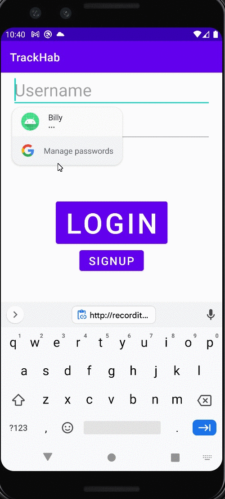
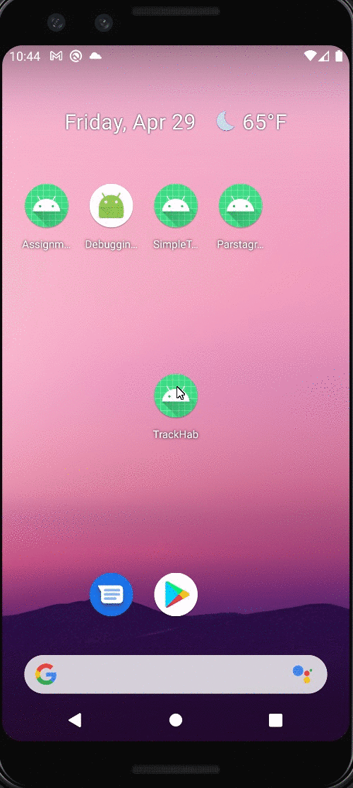

# TrackHab

## Table of Contents
1. [Overview](#Overview)
2. [Product Spec](#Product-Spec)
3. [Wireframes](#Wireframes)
4. [Schema](#Schema)

## Overview
### Description
 Habit tracking app has a daily reminder, completion rate, monthly/weekly summary etc

### App Evaluation
[Evaluation of your app across the following attributes]
- **Category:**
- **Mobile:**
- **Story:**
- **Market:**
- **Habit:**
- **Scope:**

## Product Spec

### 1. User Stories (Required and Optional)

**Required Must-have Stories**

[ ] Create habit (has a name and schedule for e.g. complete every Wednesday)  
[ ] Mark that a habit was completed for the day  
[ ] Show habit history/days complete  
[ ] Show what habits you have to do today  
[x] Register as a new user  
[x] Login as Existing User  

**Optional Nice-to-have Stories**

[ ] Needs push reminders (for e.g. if daily, a reminder every day, if weekly, a reminder every week)  
[ ] Have a display of compliance (e.g. a calendar that shows every day you completed a task and every day you failed)  
[ ] Categories habits  
[ ] Encouraging messages and pictures of cute animals as rewards for long streaks :)  

### 2. Screen Archetypes

-  Home Screen  
   - Show what habits you have to do today  
   - Mark that a habit was completed for the day  

- New Habit Screen  
   - Create habit (has a name and schedule for e.g. complete every Wednesday)  

- Login/Register Screen  
   - Login as an existing user
   - Register as a new User  

- Statistics Screen  
   - Show habit history/days complete  

### 3. Navigation

**Tab Navigation** (Tab to Screen) [None so far]

* [fill out your first tab]
* [fill out your second tab]
* [fill out your third tab]

**Flow Navigation** (Screen to Screen)

 - Home Screen  
   - => New Habit Screen  
   - => Statistics Screen
   - => Login Screen

- Login Screen  
   - => Home Screen  

- Register Screen  
   - => Home Screen  

- New Habit Screen  
   - => Home Screen  

- Statistics Screen  
   - => Home Screen  

## Wireframes
[Add picture of your hand sketched wireframes in this section]


### [BONUS] Digital Wireframes & Mockups

### [BONUS] Interactive Prototype

## Schema 
[This section will be completed in Unit 9]
### Models


### Networking
- [Add list of network requests by screen ]
- [Create basic snippets for each Parse network request]
- [OPTIONAL: List endpoints if using existing API such as Yelp]
- Home Screen
  - (GET) Query all habits where user is the creator

    ``` let query = PFQuery(className:"Habit")
     query.whereKey("userId", equalTo: currentUser)
     query.order(byDescending: "createdAt")
     query.findObjectsInBackground { (habits: [PFObject]?, error: Error?) in
        if let error = error { 
           print(error.localizedDescription)
        } else if let habits = habits {
           print("Successfully retrieved \(habits.count) habits.")
          // TODO: Do something with habits...
        }
     }
    ```
  - (Delete) Delete an existing habit 
 ```    
  habit.deleteInBackground { exception ->   
    if (exception == null) {   
      Log.i(MainActivity.TAG, "Successfully deleted habit")   
    } else {   
      Log.e(MainActivity.TAG, "Error while deleting habit")   
      exception.printStackTrace()   
    }
  }   
```   
  - (PUT) Edit an existing habit
       ```  
       habit.setHabitName(name)
         habit.setTarget(target)
         habit.frequency(frequency)
         habit.habitTerm(term)
         habit.saveInBackground { exception ->
             if (exception == null) {
                 Log.i(MainActivity.TAG, "Successfully saved habit")
     TODO: Reset fields…
             } else {
                 Log.e(MainActivity.TAG, "Error while saving habit")
                 exception.printStackTrace()
             }
         }
       ```
   - (PUT) Mark habit as complete
        ```
        habit.setCompleted(status)
        habit.saveInBackground { exception ->
            if (exception == null) {
                Log.i(MainActivity.TAG, "Successfully updated habit")
            } else {
                Log.e(MainActivity.TAG, "Error while updating habit")
                exception.printStackTrace()
            }
        }
        ```
        
- Login/Sign Up Screen
   - (GET) Query logged in user object
      ```private fun loginUser(username: String, password: String) {
           ParseUser.logInInBackground(username, password, ({ user, e ->
               if (user != null) {
                   Log.i(TAG, "Successfully logged in user")
                   goToMainActivity()
               } else {
                   e.printStackTrace()
                   Toast.makeText(this, "Error logging in", Toast.LENGTH_SHORT).show()
               }})
           )
       }	
      ```
   - (POST) Create New User
      private fun signUpUser(username: String, password: String) {
       ``` 
       // Create the ParseUser
              val user = ParseUser()
              // Set fields for the user to be created
              user.setUsername(username)
              user.setPassword(password)

              user.signUpInBackground { e ->
                  if (e == null) {
                      // User has successfully created a new account
                      goToMainActivity()
                      Toast.makeText(this, "Successfully signed up", Toast.LENGTH_SHORT).show()
                  } else {
                      e.printStackTrace()
                      Toast.makeText(this, "Error signing up", Toast.LENGTH_SHORT).show()
                  }
              }
          }
       ```
- New Habit Screen
  (POST) Create a new habit
  ```   
  val habit =  Habit()   
  habit.setHabitName(name)   
  habit.setTarget(target)   
  habit.frequency(frequency)   
  habit.habitTerm(term)   
  habit.saveInBackground { exception ->   
    if (exception == null) {   
      Log.i(MainActivity.TAG, "Successfully saved habit")   
      TODO: Reset fields…   
    } else {   
       Log.e(MainActivity.TAG, "Error while saving habit")   
       exception.printStackTrace()   
      }
   }
   ```   
 
- Statistic Screen
```
   (GET) Query all habits of a user
   let query = PFQuery(className:"Habit")
   query.whereKey("userId", equalTo: currentUser)
   query.order(byDescending: "createdAt")
   query.findObjectsInBackground { (habits: [PFObject]?, error: Error?) in
      if let error = error { 
         print(error.localizedDescription)
      } else if let habits = habits {
         print("Successfully retrieved \(habits.count) habits.")
        // TODO: Do something with habits...
      }
   }	
```

### Sprint 1

   
   

